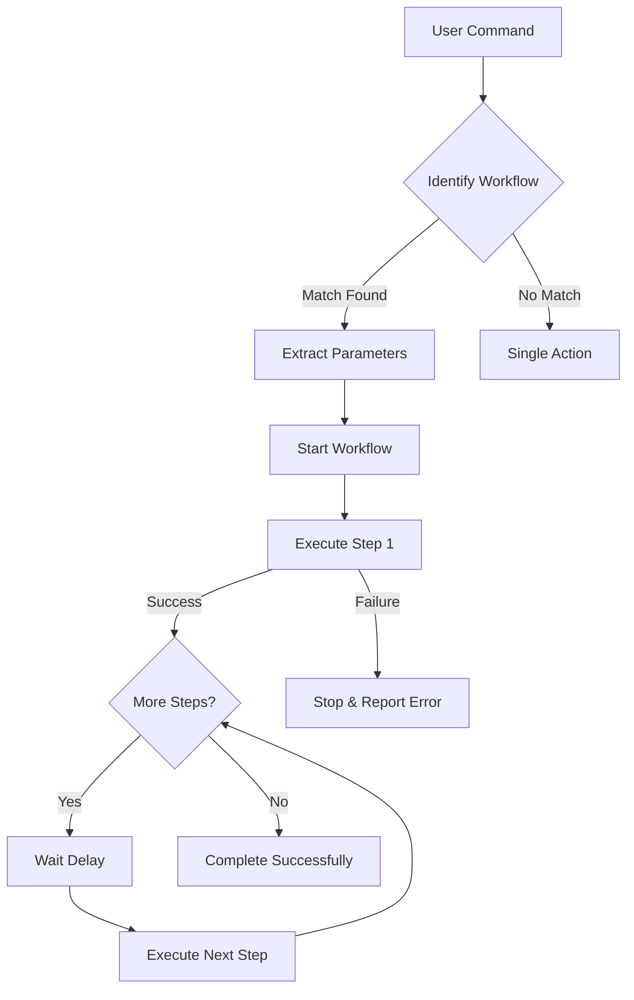

# WinBeat AI - Workflow Engine Training Guide

## 🎯 Overview

The Workflow Engine enables your AI Assistant to execute **complex, multi-step tasks** automatically. Instead of performing actions manually, you can ask the AI to chain multiple operations together.

## 📚 Architecture

### Three-Layer System

```
┌─────────────────────────────────────────┐
│   1. Natural Language Processing        │
│   - Parse user intent                   │
│   - Identify workflow type              │
│   - Extract parameters                  │
└──────────────┬──────────────────────────┘
               ↓
┌─────────────────────────────────────────┐
│   2. Workflow Engine                    │
│   - Execute steps sequentially          │
│   - Handle navigation & page actions    │
│   - Provide progress updates            │
│   - Error handling & recovery           │
└──────────────┬──────────────────────────┘
               ↓
┌─────────────────────────────────────────┐
│   3. Page Actions Service               │
│   - Register page capabilities          │
│   - Execute specific actions            │
│   - Return results with context         │
└─────────────────────────────────────────┘
```

## 🚀 How It Works

### Step 1: User Request

User provides a natural language command:

```
"go to manage registration page and search for ABC Strata and download pdf"
```

### Step 2: Intent Recognition

Workflow Engine analyzes the query:

- **Keywords detected:** "go to", "search for", "download"
- **Workflow identified:** `search-edit-download`
- **Confidence:** 90%
- **Parameters extracted:**
  - Target page: `manage-registrations`
  - Search term: `ABC Strata`
  - Company name: `ABC Strata`

### Step 3: Sequential Execution

Each step executes in order with validation:

```
Step 1: Navigate to manage-registrations page
  ↓ Success? Yes
  ↓ Wait 500ms for page load

Step 2: Search for company "ABC Strata"
  ↓ Success? Yes (Found 1 registration)
  ↓ Wait 800ms for results

Step 3: Edit/Load the registration
  ↓ Success? Yes (Loaded ABC Strata)
  ↓ Wait 800ms for form load

Step 4: Download PDF
  ↓ Success? Yes (PDF download initiated)
  ↓ Workflow Complete!
```

### Step 4: Progress Updates

User sees real-time feedback:

```
🔄 Starting workflow: Search, Edit, and Download PDF

Step 1/4: Navigate to target page...
✅ Navigated to manage-registrations

Step 2/4: Search for the record...
✅ Found 1 registration(s)

Step 3/4: Load record for editing...
✅ Loaded ABC Strata

Step 4/4: Download PDF...
✅ PDF download initiated

✨ Workflow completed successfully!
```

## 🛠️ Built-in Workflows

### 1. Search-Edit-Download

**Use Case:** Navigate, find a record, load it, and download PDF

**Trigger Patterns:**

- "go to [page] and search for [term] and download pdf"
- "find [term] and download the pdf"
- "navigate to [page], search [term], and get pdf"

**Steps:**

1. Navigate to target page
2. Search for the record
3. Load record for editing
4. Download PDF

**Example:**

```
User: "go to manage registration page and search for ABC Strata and download pdf"

AI executes:
  ✅ Navigate to /manage
  ✅ Search company "ABC Strata"
  ✅ Edit/Load ABC Strata record
  ✅ Download PDF for ABC Strata
```

---

### 2. Search-Edit

**Use Case:** Navigate to a page and load a record for editing

**Trigger Patterns:**

- "go to [page] and search for [term] and edit"
- "find [term] and edit it"
- "open [page], search [term], and edit"

**Steps:**

1. Navigate to target page
2. Search for the record
3. Load record for editing

**Example:**

```
User: "go to clients page and search for XYZ Corporation and edit"

AI executes:
  ✅ Navigate to /clients
  ✅ Search for "XYZ Corporation"
  ✅ Load XYZ Corporation for editing
```

---

### 3. Navigate-Search

**Use Case:** Go to a page and perform a search

**Trigger Patterns:**

- "go to [page] and search for [term]"
- "open [page] and find [term]"
- "navigate to [page] and look for [term]"

**Steps:**

1. Navigate to target page
2. Search for records

**Example:**

```
User: "go to users page and search for john.doe"

AI executes:
  ✅ Navigate to /users
  ✅ Search for user "john.doe"
```

---

### 4. Navigate-Create

**Use Case:** Go to a page and open the create form

**Trigger Patterns:**

- "go to [page] and create new [record]"
- "open [page] and add [record]"
- "navigate to [page] and create"

**Steps:**

1. Navigate to target page
2. Open create form

**Example:**

```
User: "go to clients page and create a new client"

AI executes:
  ✅ Navigate to /clients
  ✅ Open create form
```

## 📋 Parameter Extraction

The Workflow Engine automatically extracts parameters from natural language:

### Page Detection

```
"manage registration" → page: 'manage-registrations'
"client" or "clients" → page: 'clients'
"user" or "users" → page: 'users'
```

### Search Term Extraction

```
"search for ABC Strata" → searchTerm: "ABC Strata"
"find XYZ Corp" → searchTerm: "XYZ Corp"
"look for john.doe" → searchTerm: "john.doe"
```

### Search Type Detection

```
"search by ABN 12345678901" → abn: "12345678901"
"find LIN 12345" → lin: "12345"
"search for ABC Strata" → company: "ABC Strata"
```

## ⚙️ Configuration

### Timing & Delays

**Navigation Delay:** 500ms

- Wait time after page navigation
- Allows page components to mount

**Step Delay:** 800ms (default)

- Wait time between workflow steps
- Configurable per workflow execution

**Search Delay:** 300ms

- Wait time for page registration
- Ensures page actions are ready

### Error Handling

**Step Failure:**

- Workflow stops at failed step
- Reports which step failed
- Shows error message
- Previous steps remain completed

**Navigation Failure:**

- Cannot find target page
- Invalid page route
- Returns error immediately

**Action Failure:**

- Page action not available
- Record not found
- API errors
- User-friendly error message

## 🔄 Workflow Execution Flow



## 📊 Progress Tracking

### Real-Time Updates

Users see progress at each step:

```javascript
{
  workflowId: 'search-edit-download',
  workflowName: 'Search, Edit, and Download PDF',
  totalSteps: 4,
  completedSteps: 2,
  steps: [
    {
      step: 'navigate',
      action: 'navigate',
      status: 'completed',
      message: 'Navigated to manage-registrations'
    },
    {
      step: 'search',
      action: 'search',
      status: 'completed',
      message: 'Found 1 registration(s)'
    },
    {
      step: 'edit',
      action: 'edit',
      status: 'in-progress',
      message: 'Loading record...'
    }
  ]
}
```

### Workflow History

All executions are logged:

```javascript
workflowEngine.getHistory(); // Returns all past workflows
workflowEngine.clearHistory(); // Clear history
workflowEngine.isWorkflowExecuting(); // Check if running
```

## 🎯 Best Practices

### 1. Be Specific with Search Terms

✅ Good: "search for ABC Strata"
❌ Bad: "search for something"

### 2. Use Natural Language

✅ Good: "go to manage registrations and find ABC Strata and download pdf"
✅ Good: "find ABC Strata and get the PDF"
✅ Good: "search ABC Strata in manage registrations and download"

### 3. One Workflow at a Time

- Wait for current workflow to complete
- Don't queue multiple workflows
- Each workflow is independent

### 4. Verify Results

- Check progress messages
- Review completion status
- Confirm downloaded files

## 🔧 Extending Workflows

### Adding New Workflows

**1. Define Workflow Structure**

```javascript
'my-new-workflow': {
  name: 'My New Workflow',
  description: 'Description of what it does',
  steps: [
    { id: 'step1', action: 'navigate', description: 'Go to page' },
    { id: 'step2', action: 'search', description: 'Search records' },
    { id: 'step3', action: 'custom', description: 'Custom action' }
  ]
}
```

**2. Add Identification Logic**

```javascript
if (lowerQuery.includes('my keyword pattern')) {
	return {
		workflowId: 'my-new-workflow',
		confidence: 0.9,
	};
}
```

**3. Implement Step Executors**

```javascript
async executeCustomStep(params) {
  // Your custom logic here
  return {
    success: true,
    message: 'Custom action completed'
  };
}
```

### Adding New Actions

**1. Register Action in Page Component**

```javascript
useEffect(() => {
	const pageActionsConfig = {
		actions: {
			myNewAction: async (params) => {
				// Execute action
				return { success: true, message: 'Done!' };
			},
		},
	};

	pageActions.registerPage('my-page', pageActionsConfig);
}, []);
```

**2. Add to Workflow Engine**

```javascript
async executeMyNewAction(params) {
  const result = await pageActions.executeAction('myNewAction', params);
  return result;
}
```

**3. Update Workflow Steps**

```javascript
{
  id: 'my-step',
  action: 'myNewAction',
  description: 'Execute my new action'
}
```

## 📖 Example Scenarios

### Scenario 1: Quick PDF Download

```
User: "download pdf for ABC Strata"

If on manage registrations page:
  ✅ Search for ABC Strata
  ✅ Load record
  ✅ Download PDF

If on different page:
  ✅ Navigate to manage registrations
  ✅ Search for ABC Strata
  ✅ Load record
  ✅ Download PDF
```

### Scenario 2: Edit Client

```
User: "go to clients and edit XYZ Corporation"

Steps:
  ✅ Navigate to /clients
  ✅ Search for "XYZ Corporation"
  ✅ Load for editing
  ✅ User can now make changes
```

### Scenario 3: Search Multiple Pages

```
User 1: "search ABC Strata in registrations"
  ✅ Navigate to /manage
  ✅ Search "ABC Strata"

User 2: "find ABC Company in clients"
  ✅ Navigate to /clients
  ✅ Search "ABC Company"

User 3: "look for john.doe in users"
  ✅ Navigate to /users
  ✅ Search "john.doe"
```

## 🎓 Training Tips

### Start Simple

```
1. "go to clients page"
2. "search for ABC"
3. "edit ABC"
```

### Progress to Chains

```
1. "go to clients and search for ABC"
2. "find ABC and edit it"
```

### Master Complex Workflows

```
1. "go to manage registrations and search for ABC Strata and download pdf"
2. "navigate to clients, find XYZ Corp, and edit"
```

## ⚡ Performance

**Workflow Execution Times:**

- 2-step: ~1.3 seconds
- 3-step: ~2.1 seconds
- 4-step: ~2.9 seconds

**Optimizations:**

- Skip navigation if already on target page
- Cache page registrations
- Parallel parameter extraction
- Efficient error handling

## 🔒 Safety Features

### Validation

- Each step validates before execution
- Parameters checked for required fields
- Page availability verified

### Rollback

- Failed steps don't affect previous work
- Clear error messages
- User can retry with corrected input

### Rate Limiting

- One workflow at a time
- Prevents overlapping executions
- Queuing not implemented (by design)

## 📈 Future Enhancements

### Planned Features

- [ ] Conditional workflows (if/else logic)
- [ ] Loop workflows (batch operations)
- [ ] User-defined custom workflows
- [ ] Workflow templates
- [ ] Undo/redo capability
- [ ] Workflow scheduling
- [ ] Voice command support
- [ ] Workflow sharing/export

### Integration Opportunities

- [ ] Slack/Teams notifications
- [ ] Email reports after workflow
- [ ] Webhook triggers
- [ ] API-driven workflows
- [ ] Workflow analytics dashboard

## 🎉 Summary

The Workflow Engine provides:

- ✅ **Automation**: Chain multiple actions automatically
- ✅ **Scalability**: Easy to add new workflows and actions
- ✅ **Transparency**: Real-time progress updates
- ✅ **Reliability**: Error handling and validation
- ✅ **Natural Language**: Intuitive command syntax
- ✅ **Extensibility**: Simple API for custom workflows

**Result:** Users can execute complex tasks in seconds with simple natural language commands!
